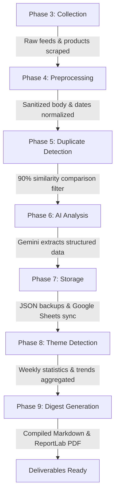

# 📋 Builder's Note: AI Research Agent

This document serves as the implementation summary and operations guide for the **AI Weekly Research Agent**, designed to automate AI news crawling, deduplication, structured summaries, and PDF newsletter compilation.

---

## 🛠️ Tool Stack Used

- **Core & Runtime**: Python 3.12+ (standard library environment)
- **Frontend Dashboard**: Streamlit (for interactive settings, runs, and analytics charts)
- **Generative AI Model**: Google Gemini API (`gemini-1.5-flash` for summaries/themes, with `gemini-1.5-pro` option)
- **Data Integration & Storage**: Google Sheets API (via `gspread` service accounts) & local JSON backups
- **Deduplication Engine**: RapidFuzz (Levenshtein distance calculation for string similarity comparison)
- **Deliverables Generation**: ReportLab PDF library (converts markdown newsletters to print-ready PDFs with dynamic headers/footers)
- **HTML Scraping & Feed Parsing**: BeautifulSoup4 (HTML cleaner) & Feedparser (RSS XML reader)

---

## 🔄 Workflow Design

The system runs sequentially through 7 clear pipeline phases to minimize manual writer overhead:

1. **Collection**: Crawls OpenAI RSS, Hugging Face RSS, TechCrunch RSS, Anthropic News (HTML parser), and Product Hunt AI category.
2. **Preprocessing**: Validates schema, strips HTML tags, normalizes whitespaces, and standardizes dates to `YYYY-MM-DD`.
3. **Duplicate Detection**: Computes Levenshtein ratio on article titles, filtering out items with >= 90% similarity.
4. **AI Analysis**: Requests structured JSON summaries, company/product lists, and importance metrics from Gemini.
5. **Storage**: Serializes backup files locally and syncs analyzed rows to a Google Sheets workbook.
6. **Theme Detection**: Aggregates weekly frequency analytics and uses Gemini to identify top themes/insights.
7. **Digest Gen**: Standardizes markdown newsletter styling and compiles it into a pagination-indexed PDF.

---

## 🛡️ Crash-Proof & Resiliency Features

To ensure the weekly pipeline is stable and **never crashes** when compiling documents (even if many sources are added or APIs are offline):

1. **ReportLab Table Wrapping**: Cell contents are dynamically wrapped inside Paragraph Flowables with hardcoded table column widths to prevent page overflowing or rendering crashes.
2. **Graceful Fallbacks**: If a section (like themes or a specific news category) is empty, the template handles it gracefully without throwing index/key errors, writing clean placeholders like `"- *No themes identified.*"`.
3. **Non-Blocking Integrations**: Google Sheets and external API connections are wrapped in `try...except` exception boundaries. If a service goes offline, a console warning is logged, and the system continues to generate the local Markdown and PDF newsletters.
4. **AI Error Recovery**: In case of network errors or invalid Gemini outputs, the AI Analyzer falls back to pre-configured schema defaults instead of passing corrupt structures down the pipeline.

---

## 🚀 Content Team Operations Manual

A content team can run and maintain this system without developer involvement using the Streamlit Web dashboard:

### 1. Initial Setup (One-Time)
- **API Key**: Create a Gemini API Key from [Google AI Studio](https://aistudio.google.com/app/apikey).
- **Google Sheets**: Copy the Spreadsheet ID of your target Google Sheet. Place your service account's `credentials.json` file in the project directory.

### 2. Running a Weekly Research Cycle
1. Run the command `streamlit run app.py` (or double-click the run script) to open the dashboard at `http://localhost:8501`.
2. Go to the **🔧 Configuration** tab:
   - Paste your **Gemini API Key** and **Google Spreadsheet ID**.
   - Click **Save Settings Override** to update settings.
3. Go to the **▶️ Run Pipeline** tab:
   - **Uncheck** "Demo Mode" (to process all weekly updates instead of a quick 3-article sample).
   - Click **🚀 Start Pipeline Run** and watch the real-time execution steps complete.
4. Go to the **📄 View Digest** tab:
   - Click **Download Weekly PDF Digest** or copy/paste the markdown newsletter template directly into your publishing editor!
5. View charts, company mentions, and category counts on the **📊 Analytics** tab.
